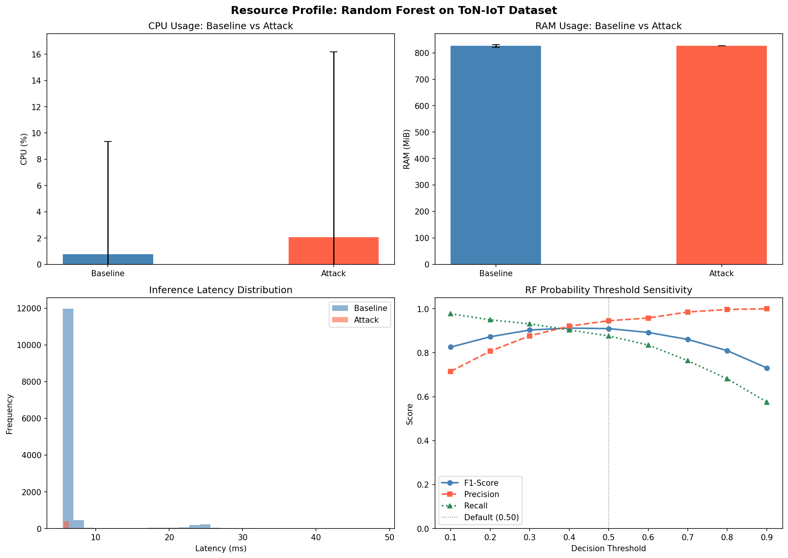

# IoT Security Monitoring — MSc Cybersecurity Project

**"A Lightweight Cloud-Based Security Monitoring and Safety Assurance Framework for Residential IoT"**

A containerised, Cloud-Edge collaborative security monitoring system for smart homes. Network flows from an IoT edge agent are streamed into a Prometheus/Grafana observability stack where a supervised Random Forest detector classifies traffic in real time.

---

## Architecture


```
IoT Edge Node  ──►  Prometheus (scrape 5 s)  ──►  Grafana (dashboard)
(universal_agent_ToN-IoT.py)                        │
    exports iot_cyber_* metrics                      └──►  AI Analyzer
    per 10-second window                                    (detector.py / RF)
```

| Layer | Component | Role |
|---|---|---|
| Edge | `IoT_Device/universal_agent_ToN-IoT.py` | Replays ToN-IoT flows; exports Prometheus metrics |
| Hub | Prometheus + Grafana | Time-series storage and real-time visualisation |
| AI | `AI_Analyzer/detector.py` | Random Forest anomaly detection (per-window inference) |

---

## Key Findings

### Model Selection: Random Forest (supervised) over Isolation Forest (unsupervised)

| Model | Precision | Recall | F1-Score | ROC-AUC |
|---|---|---|---|---|
| Statistical Threshold (mean+2σ) | 0.4795 | 0.8931 | 0.6240 | 0.9754 |
| Isolation Forest (unsupervised) | 0.3041 | 0.5038 | 0.3793 | 0.9416 |
| **Random Forest (supervised)** | **0.9008** | **0.8321** | **0.8651** | **0.9898** |

All three models evaluated on the same stratified 70/30 split (`random_state=42`), matching the split used to train the RF — ensuring zero overlap between RF training data and the test set. Train: 9,571 windows (9,266 benign, 305 attack); Test: 4,103 windows (3,972 benign, 131 attack). The statistical threshold is `flow_count > mean + 2σ` of benign training windows (15.44 flows). See [`evaluate.py`](evaluate.py) and [`evaluation_final.csv`](evaluation_final.csv).

### Resource Overhead (RF on ToN-IoT, all windows)

| Metric | Baseline (benign) | Attack windows |
|---|---|---|
| CPU | 0.8 % ± 8.6 % | 2.0 % ± 14.1 % |
| RAM | 826 MiB (stable) | 826 MiB (stable) |
| Inference latency | 6.95 ms ± 4.06 ms | 6.35 ms ± 2.63 ms |

Sub-7 ms per-window inference is viable on commodity edge hardware. See [`resource_profile.py`](resource_profile.py) and [`resource_profile_results.csv`](resource_profile_results.csv).

### Edge Deployment: Le Potato (ARM Cortex-A53, 2 GB RAM)

The IoT edge agent was profiled natively on a LibreComputer Le Potato (aarch64, 4-core @ 1.4 GHz, 2 GB RAM) running Armbian to validate deployment on constrained hardware.



| Metric | Le Potato (ARM A53) | i5-9600K (x86\_64) |
|---|---|---|
| Architecture | ARM Cortex-A53, 4-core | x86\_64, 6-core |
| CSV startup time | ~37 s | ~2 s |
| CPU — steady-state mean | 1.78 % | 4.24 % |
| CPU — steady-state max | 3.01 % | ~6 % |
| RAM — mean (RSS) | 723 MiB | 1,043 MiB |
| RAM — max (RSS) | 725 MiB | 1,205 MiB |
| OOM risk (2 GB device) | None (37 % used) | — |

The ARM device uses **30 % less RAM** and **58 % less CPU** in steady-state than the lab machine. The only meaningful edge-device penalty is the 37-second startup cost for loading the 1 M-row dataset — a one-time overhead that would not apply in a production deployment backed by a stream or database. The Docker image builds natively on aarch64 without compilation errors. Profiling data: [`lepotato_stats.txt`](lepotato_stats.txt).

---

## Dataset

**ToN-IoT Network dataset** (`data/Network_dataset_1.csv`) — flow-level captures aggregated into 10-second windows.

| Property | Value |
|---|---|
| Source | ToN-IoT (UNSW Canberra) |
| Raw flows | ~1 M |
| Windows after aggregation | 13,674 |
| Benign / Attack split | ~96.8 % / 3.2 % |
| Features used | `flow_count`, `avg_duration`, `avg_bytes` |
| Train / Test split | 70 / 30 stratified (random_state=42) |

Features match the three Prometheus metrics exported by the live agent (`iot_cyber_flow_count`, `iot_cyber_avg_flow_duration_sec`, `iot_cyber_avg_flow_bytes`), ensuring training and inference operate on identical representations.

---

## Running the Project

### Prerequisites

- Docker and Docker Compose

### Start the full stack

```bash
git clone https://github.com/HOne1987/IoT-security-monitoring.git
cd IoT-security-monitoring
docker-compose up --build -d
```

| Service | URL | Credentials |
|---|---|---|
| Grafana dashboard | http://localhost:3000 | admin / admin |
| Prometheus | http://localhost:9090 | — |

The Prometheus data source is auto-provisioned; no manual configuration required.

### Retrain the model

```bash
python train_random_forest.py          # saves to AI_Analyzer/models/
```

### Re-run the evaluation

```bash
python evaluate.py                     # three-way comparison, saves evaluation_final.*
python resource_profile.py             # CPU/RAM/latency analysis, saves resource_profile_*
```

---

## Repository Structure

```
.
├── AI_Analyzer/
│   ├── detector.py                    # RF inference loop (Prometheus → alert)
│   ├── Dockerfile
│   └── models/
│       ├── random_forest_model.pkl    # Trained model (joblib)
│       ├── scaler.pkl                 # StandardScaler
│       ├── features.txt               # Feature list
│       └── training_metadata.txt      # Training run summary
├── IoT_Device/
│   ├── universal_agent_ToN-IoT.py    # Flow telemetry agent
│   └── Dockerfile
├── Hub_Configs/
│   ├── prometheus.yml
│   └── grafana/                       # Auto-provisioned data source + dashboard
├── data/
│   └── Network_dataset_1.csv          # ToN-IoT network flows (gitignored)
├── train_random_forest.py             # Model training script
├── evaluate.py                        # Chapter 4 baseline comparison
├── resource_profile.py                # CPU / RAM / latency profiling
├── random_forest_train_test_split.py  # IF vs RF resource comparison
├── docker-compose.yml
└── evaluation_final.{csv,png}         # Results
```

---

## Thesis Structure

| Chapter | Content |
|---|---|
| Chapter 1 | Introduction — residential IoT threat landscape |
| Chapter 2 | Literature review — anomaly detection, edge computing |
| Chapter 3 | System design — architecture, dataset, feature engineering |
| Chapter 4 | Evaluation — three-way model comparison, resource analysis |
| Chapter 5 | Conclusion — findings, limitations, future work |

---

## License

See [LICENSE](LICENSE).
